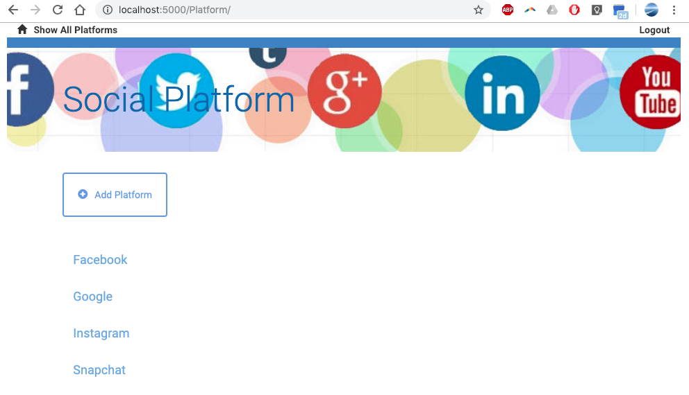
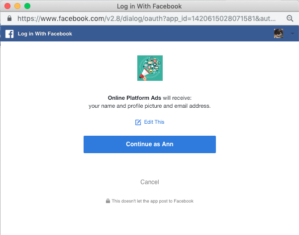
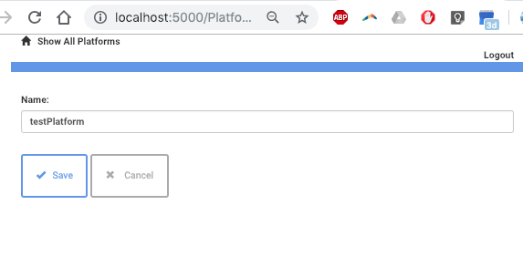
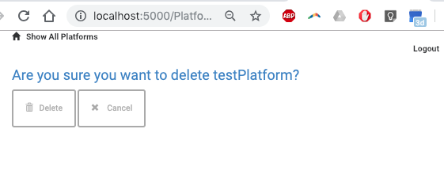
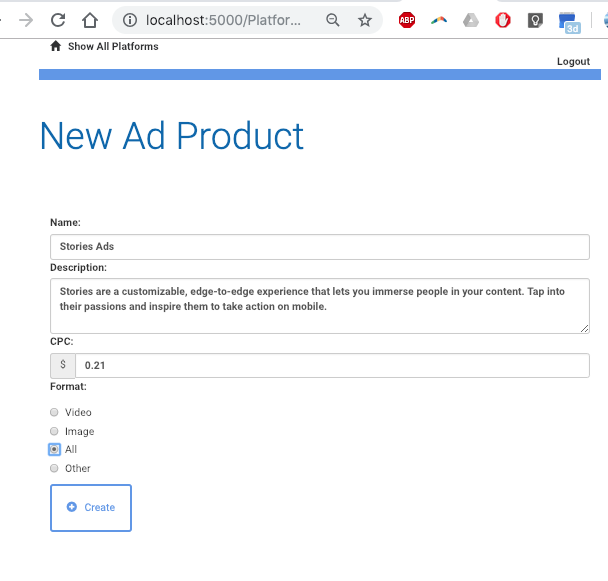
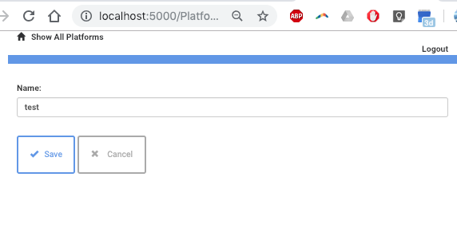

**Description**

This project was from my Item Catalog Project for [Full Stack Web Developer](https://in.udacity.com/course/full-stack-web-developer-nanodegree--nd004) Nanodegree program at Udacity.

**Instruction**

* Follow the instructions (1 - 3) (here)[https://github.com/zhou0360/web-development/tree/master/log-analysis-project] to set up vagrant machine

* Initiate _python_ session in the terminal

* Download the database (here)[https://github.com/udacity/Full-Stack-Foundations/tree/master/Lesson_1]

* Run the project.py file in vagrant vitural machine

_Please note the client secrets were hidden_

**Output**

* Show Platform

* Facebook Login

* Edit Platform

* Delete Platform

* Show Ad Products

* Create New Ad Products

* New Ad Product Added in the database

* Edit Ads Login Page

* Edit Ads

* Delete Ads

